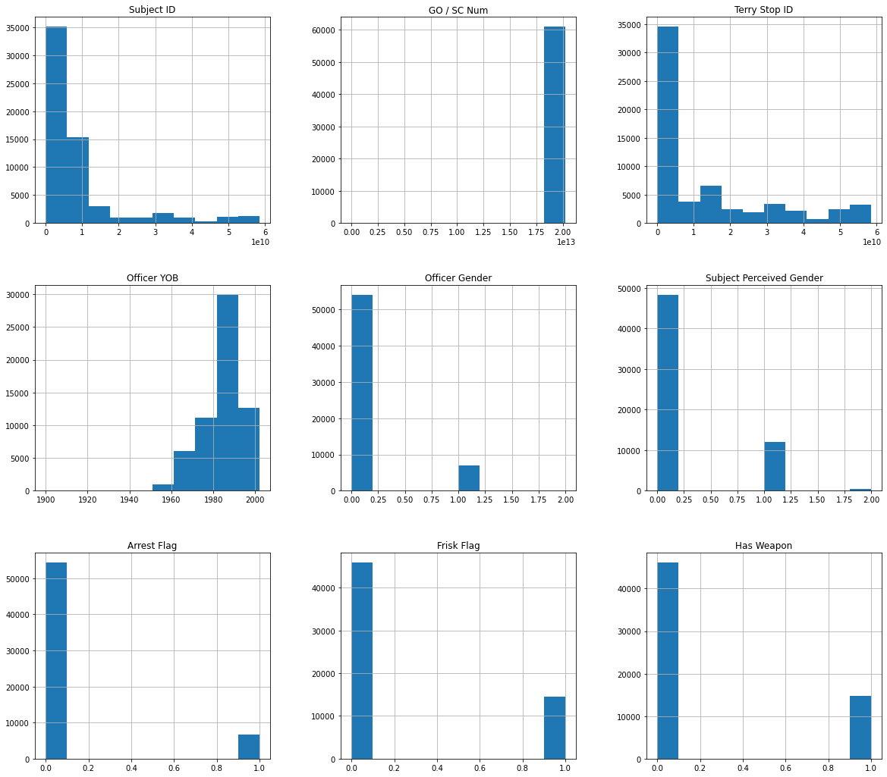
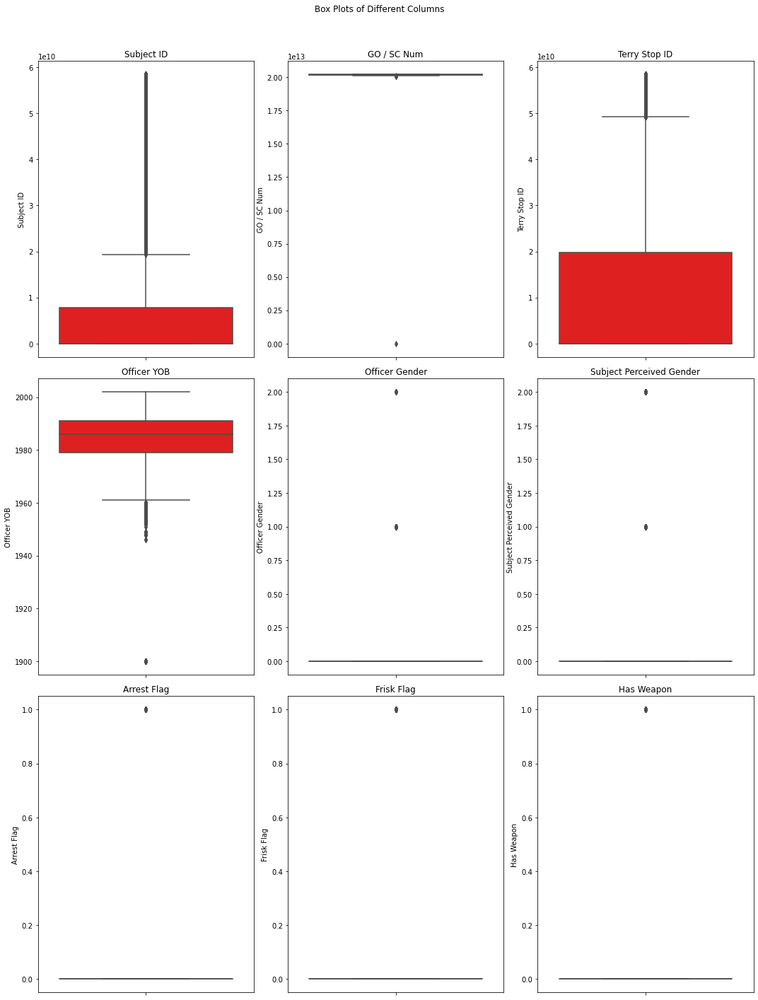
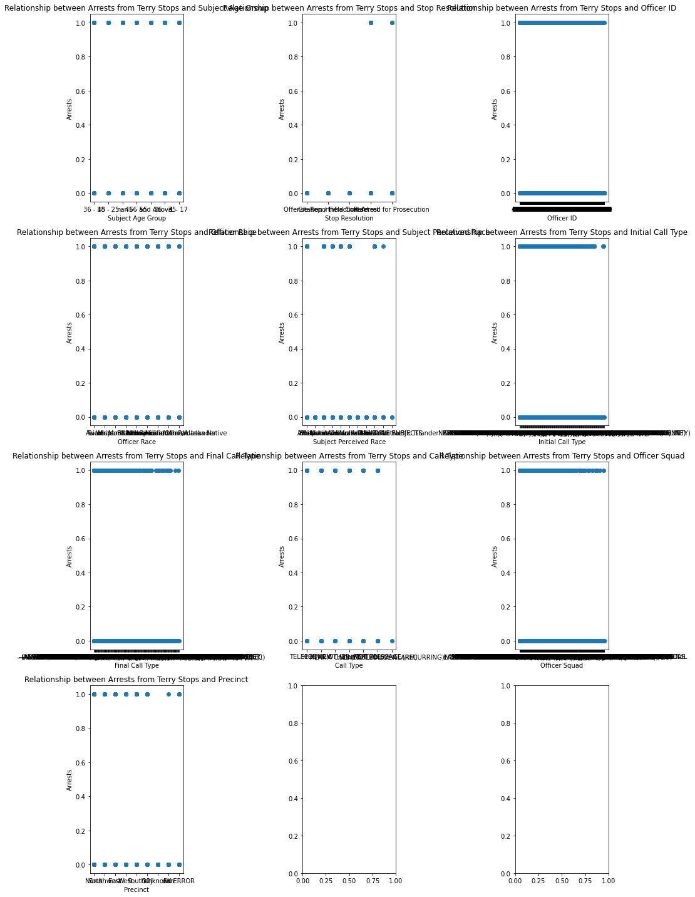
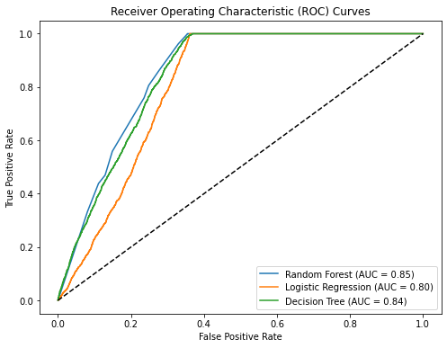

# Phase_3_proj
# Name: Bennie Kibet
# Project :Terry Stops Analysis

## Business Understanding
## Overview:

In Terry v. Ohio, a landmark Supreme Court case in 1967-8, the court found that a police officer was not in violation of the "unreasonable search and seizure" clause of the Fourth Amendment, even though he stopped and frisked a couple of suspects only because their behavior was suspicious. Thus was born the notion of "reasonable suspicion", according to which an agent of the police may e.g. temporarily detain a person, even in the absence of clearer evidence that would be required for full-blown arrests etc. Terry Stops are stops made of suspicious drivers.

Therefore, to help the public department make reasonable judgements when prosecuting such cases they would like to have a model that identifies such cases to plan on how to deal with them.

## Problem Statement:

To identify whether arrests made after a Terry Stop, has undergone the procedure of being stopped on suspicious behaviour and frisked, or if other factors play a role in the arrest.

## Metrics:

The effectiveness of Terry Stops' predictive models will be evaluated based on the accuracy score. This metric measures the proportion of correctly predicted instances among all instances, providing insight into how well the models can predict arrest occuring after a Terry Stop. A higher accuracy score indicates that the models are more reliable in identifying the arrests made due to Terry Stops.

## Objectives
1. To predict whether an arrest was made after a Terry Stop
2. Arrest given information about the presence of weapons
3. The time of day of the call

### Summary of features
1. Subject Age Group: Subject Age Group (10 year increments) as reported by the officer.
2. Subject ID: Key, generated daily, identifying unique subjects in the dataset using a character to character match of first name and last name.
3. GO / SC Num: General Offense or Street Check number, relating the Terry Stop to the parent report.
4. Terry Stop ID: Key identifying unique Terry Stop reports.
5. Stop Resolution: Resolution of the stop as reported by the officer.
6. Weapon Type: Type of weapon, if any, identified during a search or frisk of the subject.
7. Officer ID: Key identifying unique officers in the dataset.
8. Officer YOB: Year of birth, as reported by the officer.
9. Officer Gender: Gender of the officer, as reported by the officer.
10. Officer Race: Race of the officer, as reported by the officer.
11. Subject Perceived Race: Perceived race of the subject, as reported by the officer.
12. Subject Perceived Gender: Perceived gender of the subject, as reported by the officer.
13. Reported Date: Date the report was filed in the Records Management System (RMS).
14. Reported Time: Time the stop was reported in the Records Management System (RMS).
15. Initial Call Type: Initial classification of the call as assigned by 911.
16. Final Call Type: Final classification of the call as assigned by the primary officer closing the event.
17. Call Type: How the call was received by the communication center.
18. Officer Squad: Functional squad assignment (not budget) of the officer as reported by the Data Analytics Platform (DAP).
19. Arrest Flag: Indicator of whether a "physical arrest" was made, of the subject, during the Terry Stop. Does not necessarily reflect a report of an arrest in the Records Management System (RMS).
20. Frisk Flag: Indicator of whether a "frisk" was conducted, by the officer, of the subject, during the Terry Stop.
21. Precinct: Precinct of the address associated with the underlying Computer Aided Dispatch (CAD) event. Not necessarily where the Terry Stop occurred.
22. Sector: Sector of the address associated with the underlying Computer Aided Dispatch (CAD) event. Not necessarily where the Terry Stop occurred.
23. Beat: Beat of the address associated with the underlying Computer Aided Dispatch (CAD) event. Not necessarily where the Terry Stop occurred.

## EDA
The dataset contains a significant number of NaN values relative to its size in some columns(61,009 entries).

    The output indicates the count of missing values (NaN or null values) for each column in the dataset:

    Subject Age Group has 2200 missing values.
    Weapon Type has 24571 missing values.
    Officer ID has 24 missing values.
    Subject Perceived Race has 1816 missing values.
    Subject Perceived Gender has 243 missing values.
    Initial Call Type has 13477 missing values.
    Final Call Type has 13477 missing values.
    Call Type has 13477 missing values.
    Officer Squad  has 561 missing values.
    Frisk Flag has 478 missing values.

    ## Visualization of relationship

    

    From the above plot the number of arrests made were few after a terry stop

    

## Discussion
* Subject ID, GO / SC Num, Terry Stop ID: These graphs show the frequency distribution of different identifiers. The high counts in certain categories might indicate common occurrences or frequent subjects in the dataset.
* Officer YOB, Officer Gender, Subject Perceived Gender: These graphs provide insights into the demographics of officers and subjects. For example, the distribution of officer birth years (YOB) can reveal the age range of the workforce, while gender distributions can highlight diversity or lack thereof.
* Arrest Flag, Frisk Flag, Weapon: These graphs show the frequency of arrests, frisks, and weapon findings. High counts in these categories could indicate areas with more law enforcement activity or higher crime rates.

## Checking for outliers

## Discussion

* Subject ID and Terry Stop ID: These box plots show the distribution of identifiers. The median and interquartile range (IQR) indicate the central tendency and variability. Outliers, if any, can highlight unusual cases.
* Officer YOB and Officer Gender: These plots provide insights into the demographics of officers. The distribution of birth years (YOB) can reveal the age range, while gender distribution can highlight diversity.
* Arrest Flag and Subject Perceived Gender: These plots show the frequency of arrests and perceived gender of subjects. The median values and IQRs can indicate common trends and variability in these categories.
* Frisk Flag and Has Weapon: The individual points plotted for these categories can indicate the frequency and distribution of frisks and weapon findings.

But considering this is based on real data we will avoid removing outliers as it will not give accurate insight to the dataset

*Bivariate Analysis*

In this section, we will perform bivariate analysis to examine the relationship between the target variable - price and the other numeric and continuous features in the data. We will use scatter plots to show the direction, strength, and shape of the relationship between two numeric variables. This will help us understand how one variable affects or is affected by another variable and identify any patterns or trends that may exist.

## Discussion

* Subject ID and Terry Stop ID: These box plots show the distribution of identifiers. The median and interquartile range (IQR) indicate the central tendency and variability. Outliers, if any, can highlight unusual cases.
* Officer YOB and Officer Gender: These plots provide insights into the demographics of officers. The distribution of birth years (YOB) can reveal the age range, while gender distribution can highlight diversity.
* Arrest Flag and Subject Perceived Gender: These plots show the frequency of arrests and perceived gender of subjects. The median values and IQRs can indicate common trends and variability in these categories.
* Frisk Flag and Has Weapon: The individual points plotted for these categories can indicate the frequency and distribution of frisks and weapon findings.

But considering this is based on real data we will avoid removing outliers as it will not give accurate insight to the dataset

**Below cell code is Checking for multicollinearity**

*Multivariate analysis*

In this section, we will perform multivariate analysis to examine the relationship between the target variable - price and multiple features in the data. We will use heatmap to visualize the correlation matrix of the features and see how they are related to each other and to the price.

A heatmap can show us the strength and direction of the correlation between two variables using different colors and shades. This will help us identify the most important features for the prediction and avoid multicollinearity problems.

## Discussion
* Correlation Coefficients: The matrix shows correlation coefficients between variables, ranging from -1 to 1. Positive values indicate a direct relationship, while negative values indicate an inverse relationship.
* Strong Correlations: There are strong positive correlations between variables like ‘Arrest Flag’ and ‘Frisk Flag,’ suggesting that frisks often lead to arrests.
* Weak Correlations: Most variables show weak correlations, indicated by values close to zero. This suggests that many factors in Terry Stops are not strongly related to each other.
* Color Coding: The colors range from dark red (strong positive correlation) to dark blue (strong negative correlation), with lighter shades indicating weaker correlations.

Processes performed before modelling were:
1. Transforming of Categorical data using Ohe
2. Data splitting using train_test_split
3. Data Scaling using StandardScaler
4. Correcting class imbalance using SMOTE

## Baseline Logistic Regression Model

* Precision: The precision values for class 0 and class 1 are 0.939194 and 0.234691, respectively. Higher precision signifies a lower rate of false positives for that class. With a higher precision in class 0, the model demonstrates better performance in predicting class 0 than class 1.

* Recall: The recall values for class 0 and class 1 are 0.764766 and 0.592988, respectively. Recall measures the model's ability to correctly identify positive instances. Like precision, recall is higher for class 0, indicating better performance in identifying class 0 instances compared to class 1.

* F1-Score: The F1-scores for class 0 and class 1 are 0.843052 and 0.336287, respectively. The F1-score is the harmonic mean of precision and recall, balancing both metrics. Once again, class 0 has a higher F1-score than class 1.

* Accuracy: The model's accuracy is 0.746135, meaning that 74.61% of the predictions were correct out of all instances.

>Therefore, logistic regression achieves 74.61% prediction accuracy on the test data.
>Based on these metrics, it is evident that the model performs better for class 0 compared to class 1.

## Model Performance Summary
The logistic regression model demonstrates the following performance metrics:

* ROC AUC:

Training: 0.6798585343228201

Test: 0.6788768417065255

* Confusion Matrix:

True Positives (TP): 778

False Negatives (FN): 534

True Negatives (TN): 8248

False Positives (FP): 2537

* Accuracy:

Training: 0.6798585343228201

Testing: 0.7461354054724312

Observations:

* The model shows a high level of discrimination on the training data but significantly lower on the test data, suggesting potential overfitting.
* The confusion matrix indicates a considerable number of false positives, highlighting the need for model improvement.

## Cross-Validation

* After applying cross-validation with five folds, we obtained an improved model with an average accuracy of 0.7461, representing an 74.61% accuracy level in predicting arrests occuring after a Terry Stop on the test data. The training data accuracy also adjusted to 0.7461.

* This adjusted model shows no significant change in performance, accurately predicting the class labels for most instances in both training and testing datasets. The testing accuracy is slightly lower than the training accuracy, which is expected but not significantly different.

* Therefore, we can proceed to evaluate the second model to determine if it performs better in predicting customer churn compared to logistic regression.

## Decison Trees classifier model

### Classification Report Summary

The logistic regression model exhibits the following performance metrics:

* Precision:

Class 0: 0.93

Class 1: 0.32

* Recall:

Class 0:  0.89

Class 1: 0.44

* F1-score:

Class 0: 0.91

Class 1: 0.37

* Accuracy:

Overall: 0.84

* Macro Average: 

Precision: 0.625

Recall: 0.665

F1-score: 0.64

Observations:
* High precision and recall for class 0, indicating strong performance in identifying true negatives.
* The precision is lower in class 1, suggesting the model struggles to correctly identify true positives but the recall is moderate.
* Overall accuracy of 84%, suggesting robust performance across all instances.
* The macro average shows that there is a disparity between the performance on Class 0 and Class 1, with Class 1 being harder for the model to predict correctly.
* The ROC AUC for the test set (0.66) suggests that the model has moderate discrimination ability on unseen data, although there is a notable drop from the training set's ROC AUC (0.88).
> To gain further insights, we will examine the classification report for all metrics related to the Decision Tree classifier.

## Random forest model

Confusion Matrix Breakdown

True Positives (TP): 8537
* These are instances where the model correctly predicted the positive class.

False Negatives (FN): 2248
* These are instances where the model incorrectly predicted the negative class when it was actually positive.

False Positives (FP): 465
* These are instances where the model incorrectly predicted the positive class when it was actually negative.

True Negatives (TN): 847
* These are instances where the model correctly predicted the negative class.

Insights
* High True Positives: The model is quite effective at identifying the positive class, as indicated by the high number of true positives.
* False Negatives: There is a significant number of false negatives, suggesting that the model misses a considerable portion of the positive class.
* False Positives: The number of false positives is relatively low, indicating that the model is less likely to incorrectly identify the negative class as positive.
* True Negatives: The true negatives are also relatively low, which might indicate an imbalance in the dataset or a need for model improvement.

>For class 0 (negative class):

* Precision: A value of 94.8% means that when the model predicts the negative class, it is correct 94.8% of the time.
* Recall: At 79.2%, this indicates that the model correctly identifies 79.2% of the actual negative instances.
* F1-score: With a value of 86.2%, this metric provides a balanced measure of precision and recall, combining both into a single value.
* Support: There are 10785 instances of the negative class in the dataset.
>For class 1 (positive class):

* Precision at 27.4% means that when the model predicts the positive class, it is accurate 27.4% of the time.
* Recall at 64.6% indicates that the model correctly identifies 64.6% of the actual positive instances.
* The F1-score at 38.4% provides a balanced measure of precision and recall for the positive class.
* Support indicates there are 1312 instances of the positive class in the dataset.
* The Random Forest classifier achieves an overall accuracy of about 77.6%, showing the percentage of correctly predicted instances overall.

### Summary

* Based on the analysis of the three models, it is evident that logistic regression performs poorly in predicting arrests after a Terry Stop.
* In contrast, both the Random Forest classifier and Decision Trees perform well with accuracies of 77.6% and 84%, respectively.
* Therefore, it is crucial to enhance the performance of the Random Forest classifier and Decision Trees by tuning hyperparameters to achieve even better accuracy.
* Hyperparameters are essential for improving the efficiency and performance of models.

### Hyperparameter Tuning
* Hyperparameters are settings that are predetermined and not learned from the data during model training.
* They govern aspects like model complexity, regularization, learning rate, and number of iterations.
* As the Random Forest classifier is our best-performing model among the three, we will employ Gridsearch to enhance its performance.

### Random Forest

After optimizing the parameters for the Random Forest classifier using grid search, our model showed improved performance as described below:
* The accuracy of the Random Forest model now stands at 79%, indicating that it correctly predicted the class labels for the test data with around 79.9% accuracy and achieved 88.7% accuracy on the training data, making it highly effective for predicting arrests occuring after a Terry Stop.
* The confusion matrix with tuned parameters shows 714 true positives (TP), 8951 true negatives (TN), 1834 false positives (FP), and 598 false negatives (FN), demonstrating excellent predictive capability.

* The tuned Decision Tree model achieved a training accuracy of 87.5% and an improved test accuracy of 88%. This suggests that the model is performing well and has learned patterns in the data that enable accurate predictions.
* The Logistic Regression model attained an AUC-ROC score of around 0.6799 on the training data and 0.6789 on the test data.

## Evaluation
## Analysis accuracy level
* We have developed three machine learning models to predict arrests occuring after Terry Stops in Seattle. Upon testing, we found that logistic regression performs poorly, achieving a training accuracy of 74.61% and a testing accuracy of 67.98%. Despite applying 3-fold cross-validation to mitigate overfitting, the training accuracy dropped to 67.99% and the testing accuracy to 67.89%.

* In contrast, the decision tree classifier and random forest models demonstrated better accuracy. The decision tree achieved training and testing accuracies of 87.99% and 84.01%, respectively, while the random forest model had a training accuracy of 87.47% and a testing accuracy of 77.57%.

* Therefore, it is evident that the decision tree model had the best average prediction accuracy, followed by the random forest. To further improve our prediction accuracy, we applied hyperparameter tuning using GridSearch.

* After hyperparameter tuning, the decision tree model's accuracy improved to 88.7% on the training data and 79.9% on the testing data. The random forest model's accuracy improved to 88.7% on the training data and 79.9% on the testing data.

* This indicates that there was some overfitting in the random forest model, making the decision tree preferable. In terms of precision, recall, and F1 score, the tuned decision tree outperformed the random forest classifier.

## ROC curve to check the best model

## Model Comparison Summary
Based on the AUC (Area Under the Curve) values from the ROC (Receiver Operating Characteristic) curve, the following inferences can be made about the models' performance:

* Decision Tree:

AUC: 0.84

Inference: Exhibits the strongest discriminatory power, effectively distinguishing between positive and negative classes. Maintains a high true positive rate (TPR) with a low false positive rate (FPR), resulting in a large ROC curve area.
* Random Forest:

AUC: 0.85

Inference: Demonstrates good classification ability slightly better than the Decision Tree. May have marginally lower false positive and false negative rates.
* Logistic Regression:

AUC: 0.80

Inference: Shows the weakest discriminatory performance among the three models, with potentially higher false positive and false negative rates.

Conclusion:

* The Random Forest is identified as the best model for Arrests predictions due to its largest area under the ROC curve and highest accuracy and the most improved hence best in predicting Arrest occuring after Terry Stops.
* The Decision Tree also performs well but is slightly less effective than the Random Forest.
* The Logistic Regression model, while useful, has the lowest AUC, indicating comparatively weaker performance in distinguishing between classes.

## Conclusion
> By leveraging the best model, which is the Random Forest, the public safety department can achieve significant benefits:

* Accurate Prediction of arrests after a Terry stop: The model's high accuracy ensures effective identification of arrests likely to occur, enabling preparation on how to prosecute such cases.
* Resource Allocation: Efficient Use of Resources: By predicting the likelihood of an arrest following a Terry stop, departments can allocate resources more effectively. This ensures that officers are deployed where they are most needed, potentially reducing response times and improving overall efficiency.
* Crime Prevention through proactive Policing: Predictive models can help identify patterns and hotspots for criminal activity. This allows officers to be more proactive in their patrols, potentially preventing crimes before they occur.
* Improved Training and Policies through data-driven decisions: Analysis of predictive data can inform training programs and policy adjustments. Departments can identify areas where officers may need additional training or where policies might need to be revised to improve outcomes.
* Community Trust (Transparency and Accountability): Using data to predict arrests can increase transparency in policing practices. When the public sees that decisions are based on data and not bias, it can help build trust between the community and the police.
* Legal and Ethical Compliance reducing bias: Predictive models can help ensure that Terry stops are conducted based on objective criteria rather than subjective judgment, potentially reducing instances of biased policing.
* Enhanced Officer Safety: Predicting the likelihood of an arrest can also help assess the risk level of a situation, allowing officers to take necessary precautions to ensure their safety.

